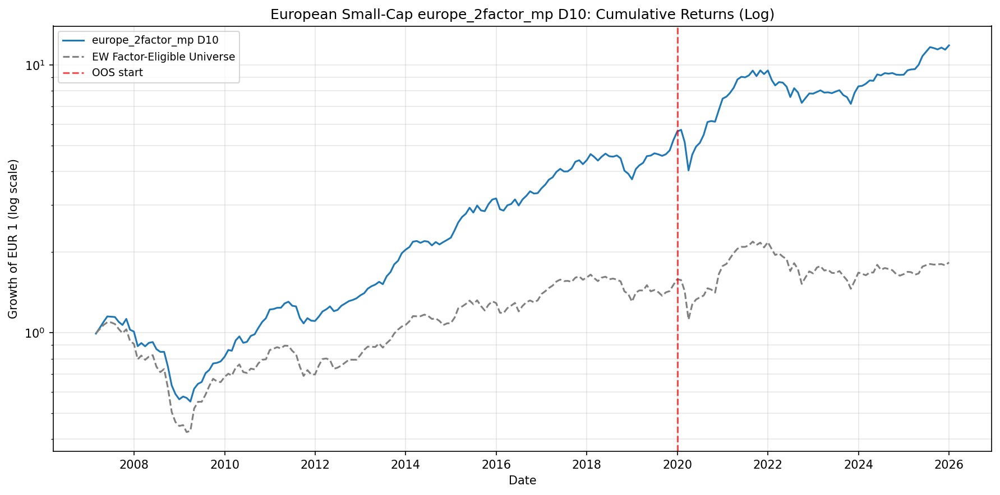
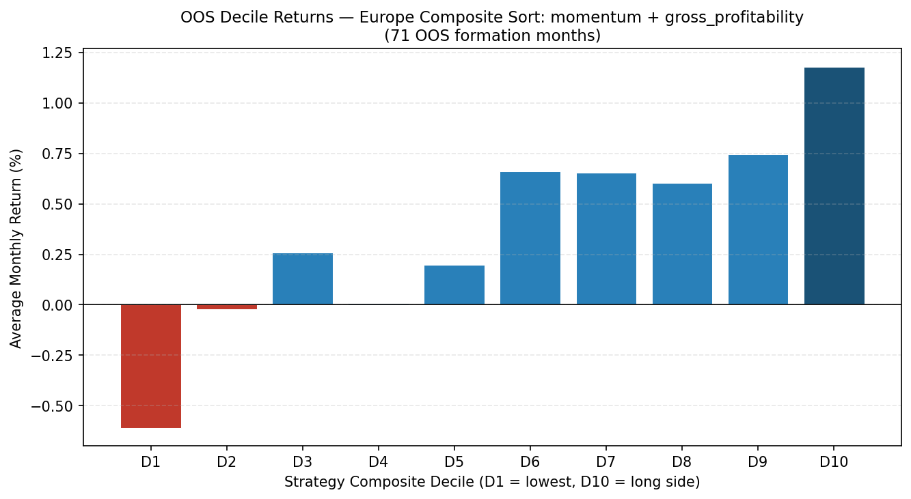

# Momentum and Profitability in European Small-Cap Equities

A cross-sectional factor model for European small caps (EUR 180M to 1.8B market
capitalization, 15 markets, 2007 to 2025), built on point-in-time Compustat
Global data with a fixed in-sample / out-of-sample split at 2020-01. The
emphasis is on the mechanics that make backtest numbers trustworthy: look-ahead
prevention, data-integrity checks, and test-enforced invariants. The factor
signals themselves are deliberately taken from the published literature
(Jegadeesh and Titman 1993; Novy-Marx 2013).

**This repository is the documentation surface of a private codebase.** It
contains the research note and an architecture overview; the pipeline source,
test suite, and full chronological research log are private and available on
request.

- **[Read the research note](paper/europe_smallcap_factors.pdf)** (PDF, 9 pages)
- **[Architecture overview](docs/architecture.md)**

## Headline results

Long-only top decile (D10, roughly 100 names, monthly rebalance, equal weight),
excess return versus the equal-weighted factor-eligible universe, EUR,
price-only returns, gross of costs:

| Strategy | Period | Excess (ann.) | NW *t* | Sharpe | IR | Turnover |
|---|---|---:|---:|---:|---:|---:|
| Momentum + gross profitability (MP) | OOS 2020-25 | +9.7% | 4.41 | 0.75 | 1.42 | 261% |
| Momentum + quarterly profitability (MI) | OOS 2020-25 | +15.4% | 4.54 | 1.04 | 2.03 | 314% |

A market-neutral variant (short a European small-cap ETF against the long book,
rolling 24-month hedge ratio) attains an out-of-sample net Sharpe ratio of
1.4 to 1.7 (MI) with CAPM market beta statistically indistinguishable from
zero. A capacity study replays the strategy under participation-limited
execution and puts the useful ceiling near EUR 500M. Details, including cost
assumptions and break-even levels, are in the note.

## Research discipline

The following are enforced in code and by the test suite:

- In-sample / out-of-sample split fixed before evaluation and never moved.
- Accounting data enters factor ranks only from filing availability (fiscal
  period end plus a 90-day publication lag), enforced by a backward as-of
  merge and runtime assertions.
- Momentum and forward returns use exact calendar-month lookups; listing gaps
  yield missing values.
- Portfolio selection never conditions on forward return availability.
- About 150 tests, including property-based tests (Hypothesis), an end-to-end
  snapshot regression against committed fixtures, and offline tests pinning
  the shape of the vendor SQL queries.
- Dated data-vintage snapshots with SHA-256 manifests; any backtest can be
  replayed against a specific vintage.

## Conventions and limitations

Reporting conventions first: returns are price-only (dividends excluded on
both the strategy and benchmark sides), transaction costs are an assumption
(30 bps round-trip, with break-even cost levels reported in the note), and
Sharpe ratios use a zero risk-free rate. Ratio levels therefore compare
within these documents rather than across publications.

Substantive limitations are catalogued in the note's closing section,
together with two tested and rejected design alternatives: state-dependent
risk overlays (regime detection, volatility scaling, crowding signals) and
a gradient-boosted challenger to the linear factor combination. The most
consequential limitation is that the out-of-sample window was evaluated
repeatedly across research iterations, so the reported out-of-sample
figures are not a one-shot test. Nothing here is investment advice.

## Tooling

The codebase and this documentation were developed with substantial AI
assistance (Claude Code).
Methodology, research decisions, code review, and validation are the
author's; changes to production modules go through a per-change review
workflow, and every reported number is reproducible from the pipeline
against versioned data snapshots.

## Contact

Source code, the research log, and further detail are available on request:
johannes.benthaus@gmail.com.
