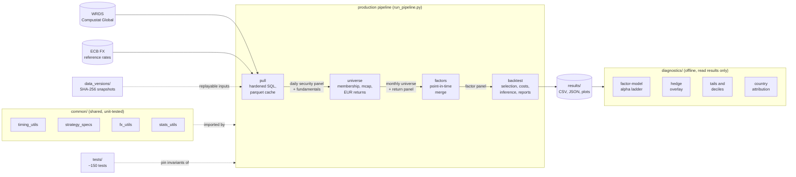

# Architecture Overview

This document describes the structure and design principles of the research
pipeline behind the [research note](../paper/europe_smallcap_factors.pdf). The
source
itself is private; the code excerpts below are verbatim (lightly trimmed) and
chosen to show how the design principles look in practice.

## System at a glance



A single entry point runs the production path. Diagnostics are separate
offline scripts that read the backtest's output files.
Two facilities cut across everything: a test suite that pins the pipeline's
invariants, and a data-versioning tool that snapshots the input caches under
dated, SHA-256-manifested directories so any result can be replayed against a
specific data vintage.

## Module map

```
run_pipeline.py            entry point: pull (cached) -> universe -> factors -> backtest
europe/
  pull.py                  WRDS queries and caching; schema treated as a contract
  universe.py              monthly membership, company-level mcap, daily->monthly EUR returns
  factors.py               factor computation and the point-in-time factor/return merge
  backtest.py              composite ranking, decile selection, costs, inference, reporting
common/
  timing_utils.py          exact-month forwards and momentum; runtime timing assertions
  strategy_specs.py        the factor and strategy registry (single source of truth)
  fx_utils.py              ECB-based EUR conversion, missing-rate accounting
  ranking.py               cross-sectional percentile ranks
  stats_utils.py           Newey-West inference, Fama-MacBeth regressions
  reporting_utils.py       standardized text / Markdown / JSON summary writers
diagnostics/               offline analyses of backtest output (alpha ladder, hedge
                           overlay, tail diagnostics, country attribution), with
                           vintage-pinned external data caches committed alongside
tests/                     ~150 tests: unit, property-based, query-shape, end-to-end snapshot
```

## Design principles, with code

**1. Exact-calendar timing.** Forward returns and momentum windows are
computed by explicit month-end lookups.
The failure mode this prevents: when a stock leaves the panel for some months
and returns, positional operations silently align a formation month with a
return realized several months later, which both corrupts momentum windows
and leaks the wrong month into the dependent variable. The forward-return
primitive is small enough to show whole (docstring condensed): the lookup is
keyed by calendar arithmetic, so a missing target month yields a missing
forward.

```python
def build_exact_month_forwards(panel, entity_col, month_col, ret_col):
    """Compute the 1-month-ahead forward return via an exact month-end lookup.

    fwd_ret_1m is NaN whenever T+1's return is absent from the entity's
    panel, so a gap never aligns a row onto a later month's return.
    """
    df = panel[[entity_col, month_col, ret_col]].copy()
    df[month_col] = pd.to_datetime(df[month_col])
    assert_month_end(df, month_col)
    df[ret_col] = pd.to_numeric(df[ret_col], errors="coerce").astype("float64")

    # The lookup carries the value: each (entity, T) -> ret_T, restricted to
    # valid returns, then shifted back one month so a row originally at T+1
    # lands on T. A missing or NaN target return yields NaN.
    valid = df.dropna(subset=[ret_col])
    lookup = valid.drop_duplicates(
        subset=[entity_col, month_col], keep="last"
    ).copy()
    lookup[month_col] = lookup[month_col] - pd.offsets.MonthEnd(1)
    lookup = lookup.rename(columns={ret_col: "fwd_ret_1m"})

    # Output is keyed on every panel row: the left merge attaches fwd_ret_1m
    # wherever T+1 exists, NaN elsewhere.
    df = df.merge(lookup, on=[entity_col, month_col], how="left")
    return df[[entity_col, month_col, "fwd_ret_1m"]]
```

**2. Point-in-time by construction.** Accounting data joins the return panel
through a backward as-of merge keyed on filing availability (fiscal period
end plus publication lag), so the main path cannot use a filing before it was
public. For ad-hoc analyses that join filings to months by other routes, the
same invariant is re-checkable in one call. It reads: no row may use a filing
that became available after the formation month.

```python
def assert_point_in_time(df, month_col, avail_col):
    """Assert no avail_date > month_end (look-ahead violation)."""
    valid = df[df[avail_col].notna() & df[month_col].notna()]
    violations = valid[valid[avail_col] > valid[month_col]]
    assert len(violations) == 0, (
        f"Look-ahead violation: {len(violations)} rows where "
        f"{avail_col} > {month_col}"
    )
```

**3. One source of truth for factor semantics.** Whether a factor is
better-when-high or better-when-low, how long its accounting data takes to
become public, and when a filing goes stale are all defined in a single
frozen registry that the backtest, the diagnostics, and the tests read.
A test asserts that no module defines a local copy. Two entries illustrate
the range (a market-data factor with no lag, and an annual accounting factor
with a 90-day publication lag and a staleness cap):

```python
@dataclass(frozen=True)
class FactorSpec:
    name: str
    market: str             # "us" | "europe"
    source_type: str        # "annual" | "quarterly" | "market"
    direction: int          # +1 high is good, -1 low is good
    stale_after_days: int | None
    avail_lag_days: int     # publication lag; 0 for market data
    value_column: str
    rank_column: str

EUROPE_FACTOR_SPECS = {
    "momentum": FactorSpec(
        name="eu_momentum_12_2", market="europe", source_type="market",
        direction=+1, stale_after_days=None, avail_lag_days=0,
        value_column="momentum", rank_column="momentum_rank",
    ),
    "accruals": FactorSpec(
        name="eu_accruals_a", market="europe", source_type="annual",
        direction=-1, stale_after_days=548, avail_lag_days=90,
        value_column="accruals", rank_column="accruals_rank",
    ),
    # ... gross profitability, quarterly profitability, asset growth, ...
}
```

**4. Selection never sees outcomes.** Forward returns are the dependent
variable only. Portfolio membership is a function of factor ranks alone;
months with missing forward returns simply contribute fewer names to that
month's realized portfolio return. A dedicated test verifies that setting
all forward returns to missing leaves the selected portfolios unchanged.

**5. No silent degradation.** A data problem that changes the meaning of the
output (a wholesale source substitution, a currency-basis change) raises. A
bounded per-item gap (one currency-month without an FX rate) becomes a
missing value, counted and warned about above a threshold.

**6. Reproducibility as a first-class concern.** Input caches are
snapshotted into dated directories with SHA-256 manifests, and the pipeline
can run against any snapshot. External series used by diagnostics (factor
libraries, exchange rates, the hedge ETF) are downloaded once and committed,
pinning their vintage. An end-to-end regression test asserts that the full
pipeline reproduces committed fixture outputs byte-for-byte.

**7. Production and exploration are separated.** The production modules are
small and stable, and changes to them go through a per-change review
workflow. Exploratory work lives in a separate investigation area with its
own lifecycle, and findings are recorded in a chronological research log.

## What the tests pin down

The suite is roughly 150 tests in five families:

- **Temporal mechanics**: exact-month forwards, momentum windows, gap
  handling, month-end and unique-key assertions.
- **Property-based suites** (Hypothesis): these generate hundreds of
  randomized panels per run (varying entities,
  gap patterns, and lengths) and assert invariants on all of them, such as
  locality (a forward depends only on its own two months) and row-order
  determinism.
- **Factor formulas and FX**: denominator guards, missing-rate handling.
- **Query-shape tests**: the vendor SQL is pinned offline against a fake
  connection, down to partitioning keys and canonical-row filters, so a
  refactor cannot silently change what the database returns.
- **End-to-end snapshot**: the full pipeline against committed fixtures.

One property test as an example. The invariant: an entity's forward returns
must be identical whether it is processed alone or alongside other entities,
i.e. there is no cross-contamination between stocks in the timing primitive.
Hypothesis searches for a counterexample panel; if one exists, it finds and
minimizes it.

```python
@given(panel=_random_panel(n_entities=(2, 2), n_months=(2, 18)))
def test_cross_entity_isolation(self, panel):
    full = build_exact_month_forwards(panel, "entity", "month_end", "ret")
    slices = [
        build_exact_month_forwards(
            panel[panel["entity"] == ent], "entity", "month_end", "ret")
        for ent in panel["entity"].unique()
    ]
    sliced = pd.concat(slices, ignore_index=True)
    pd.testing.assert_frame_equal(
        full.sort_values(["entity", "month_end"]).reset_index(drop=True),
        sliced.sort_values(["entity", "month_end"]).reset_index(drop=True),
        check_dtype=False,
    )
```

## Scope of this document

This overview covers structure and principles. The
private repository contains the full pipeline source, the test
suite, the capacity and liquidity investigation, the hedge construction, and
a chronological research log documenting every methodological decision and
data correction. Available on request.
